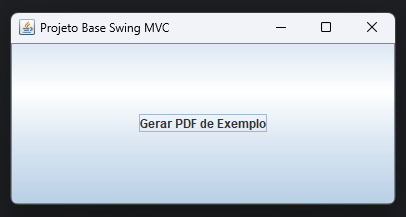

# Projeto Base Java Swing (MVC + Maven)

Este é um **modelo de projeto Java Swing** estruturado com o padrão **MVC (Model-View-Controller)** e gerenciado via **Maven**.  
Serve como ponto de partida para novos projetos desktop em Java.

---

## 🚀 Descrição

Fornecer uma base simples e reutilizável para aplicações Swing, com:
- Estrutura organizada em camadas (MVC)
- Geração de PDF com **iText**
- Build Maven limpo (JAR + dependências externas em `lib/`)
- Fácil execução e manutenção

---

## Captura de tela



---

## Badges


[](https://opensource.org/licenses/MIT)

---

## Pré-requisitos

- **Java JDK 21 ou superior**
    - Baixar: [Oracle JDK](https://www.oracle.com/java/technologies/javase/jdk21-archive-downloads.html)
- **Maven**
    - Baixar: [Apache Maven](https://maven.apache.org/download.cgi)
- IDE recomendada: **IntelliJ IDEA** ou qualquer IDE que suporte Maven e Java

## 🧱 Estrutura do Projeto Após o build:


```
target/
├── projeto-base-swing-1.0.jar
└── lib/
    ├── itext7-core-8.0.3.jar
    └── slf4j-simple-2.0.12.jar
```

---

## ⚙️ Tecnologias

- **Java 21+**
- **Maven 3.8+**
- **Swing** – Interface gráfica
- **iText 7** – Geração de PDFs (Apenas para exemplo)
- **SLF4J** – Logging simples (Apenas para exemplo)

---

## ▶️ Executando o Projeto

### 1️⃣ Compilar e empacotar
```bash
mvn clean package
```

### 2️⃣ Executar
```bash
java -jar target/projeto-base-swing-1.0.jar
```

O aplicativo abrirá uma janela Swing com um botão que gera um PDF simples chamado `saida.pdf` na raiz do projeto.

---

## 🧩 Como funciona o MVC

- **Model:** Lógica e dados da aplicação (ex: geração de PDF).
- **View:** Interface gráfica (Swing JFrame).
- **Controller:** Liga o Model à View (reage a cliques e eventos).
---

## 📦 Distribuição

Copie o conteúdo da pasta `target/` (JAR + `lib/`) para outro local.  
Para rodar:
```bash
java -jar projeto-base-swing-1.0.jar
```

---

## 🧑‍💻 Autor

**Maicon Marino Albertini**  
Template base para projetos Java Swing utilizando Maven e padrão MVC.  
Licença: MIT
